# NAMDRunner

**NAMDRunner** is a GUI-based desktop application designed to manage the full lifecycle of NAMD molecular dynamics simulations on remote command-line high performance computing (HPC) clusters.

<p align="center">
    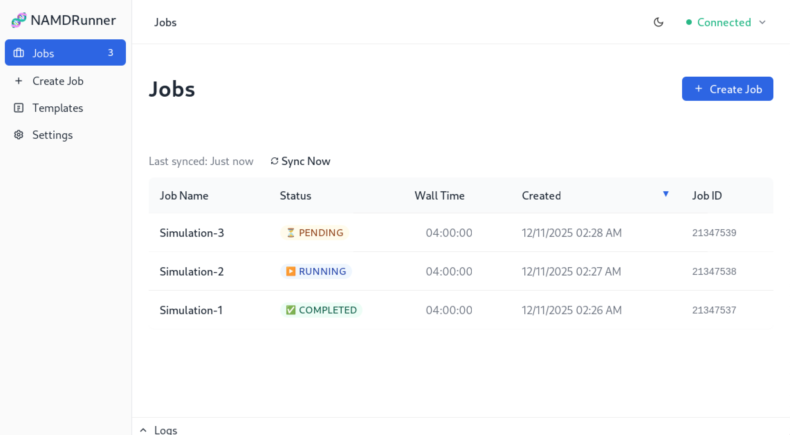
</p>
<p align="center">
    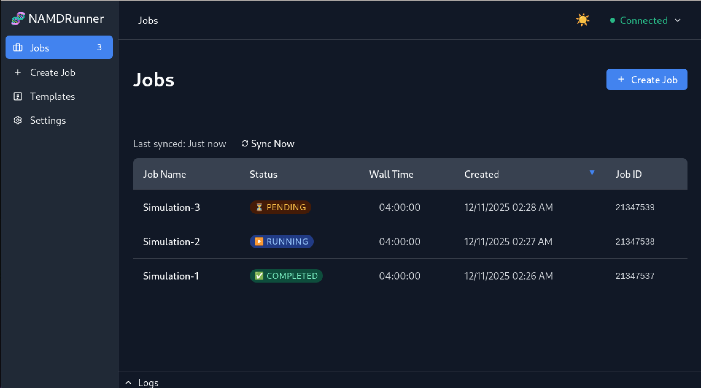
</p>

## Overview

NAMDRunner was built to make it easier for researchers to manage complex simulations on High Performance Computing (HPC) clusters. Instead of manually writing job scripts for NAMD (Nanoscale Molecular Dynamics, an all-atom molecular dynamics simulator) and SLURM (Simple Linux Utility for Resource Management, a cluster job scheduler), managing files with SFTP, and executing SSH commands to manage and track progress, the tool provides a graphical user interface for:

* Securely connecting to clusters.
* Configuring simulations and uploading input files.
* Managing job project and scratch storage.
* Monitoring real-time job status.
* Retrieving and managing results.

## Project Goals

The goal of this tool is to assist with the the design of DNA Origami structures by enabling rapid simulation of designs to understand how specific thymine (T) base pair alignments lead to different Cyclobutane Pyrimidine Dimer (CPD) bonds.

1. Run NAMD simulations on DNA Origami designs to analyze T-T base pair alignment before CPD formation.
2. Identify which designs lead to ideal CPD alignments.
3. Use these insights to improve the DNA Origami designs.

## Key Features

* **Job Management**: Complete Job lifecycle. Create, Submit, Monitor, and Delete jobs directly from the UI. Synchronizes job states between the remote scheduler (via JSON metadata) and a local SQLite cache.

* **SLURM Automation**: Auto-generates `sbatch` scripts based on user resources and template configs.

* **NAMD Automation**: Auto-generates `namd` scripts based on user selected template, parameters, and input files.

* **Remote Connection**: Secure SSH and SFTP file management. Manages files, job metadata, and executes SLURM commands on remote cluster.

* **Cluster Storage**: Automatically manage data storage locations.
  * **Scratch Storage**: Active job data is stored here. Required for job access, but temporary (automatic purge policy).
  * **Project Storage**: Long-term data, job results are moved here for persistent storage.
  * **Automation**:
    * When a job is created, NAMDRunner uploads the project files and scripts to *Project* storage.
    * When a job is submitted, NAMDRunner syncs the job files from *Project* to *Scratch* storage.
    * When a job is completed, NAMDRunner syncs job files from *Scratch* to *Project* storage.
    * When a job is deleted, NAMDRunner removes the job files from *Project* storage and the application DB.

* **Templates System**: Reusable NAMD simulation templates with user editable variables.
  * Templates contain "Variables" (e.g., `{{temperature}}`, `{{step_count}}`).
  * Select the appropriate template when creating a job, fill in the variables, and the application will generate and upload the `.namd` configuration file.
  * Export/Import feature to backup or share templates.

* **Configuration**: User-editable cluster settings (partitions, QoS) and application appearance (Light/Dark themes).

### Project Overview

#### Architecture

NAMDRunner is built with a **Svelte (TypeScript)** frontend and **Tauri v2 (Rust)** backend. Has a local SQLite database for template storage, settings configuration, and offline job details.

```
src-tauri/              # Rust Backend
├── src/
│   ├── automations/    # Job lifecycle workflows (Create, Submit, Sync)
│   ├── commands/       # IPC adaptors for Frontend <-> Backend
│   ├── ssh/            # SSH/SFTP connection & file management
│   ├── templates/      # NAMD configuration template engine
│   ├── database/       # SQLite storage logic
│   └── validation/     # Input & Business logic validation
src/                    # Svelte Frontend
├── lib/
│   ├── stores/         # Reactive UI state (Svelte Stores)
│   ├── components/     # UI Components
│   └── types/          # TypeScript definitions matching Rust
```
#### Documentation

* [docs/ARCHITECTURE.md](docs/ARCHITECTURE.md)
* [docs/DB.md](docs/DB.md)
* [docs/SSH.md](docs/SSH.md)
* [docs/API.md](docs/API.md)
* [docs/AUTOMATIONS.md](docs/AUTOMATIONS.md)
* [docs/CONTRIBUTING.md](docs/CONTRIBUTING.md)
* [docs/DESIGN.md](docs/DESIGN.md)

## Application Screenshots

### Job Management

Real-time monitoring of job status (Queued, Running, Completed) with live updates from SLURM.

<p align="center"></p>

### Template System

Creating a new simulation template with custom variables.

<p align="center">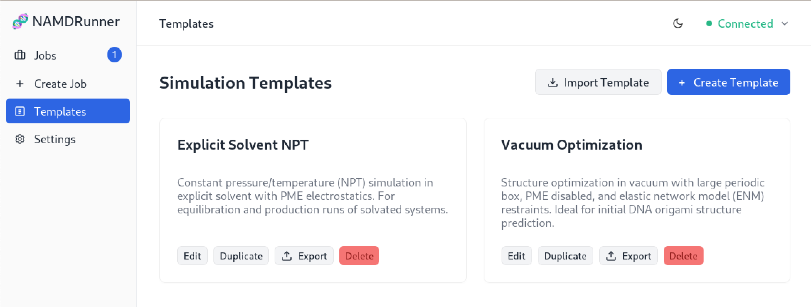</p>

<p align="center">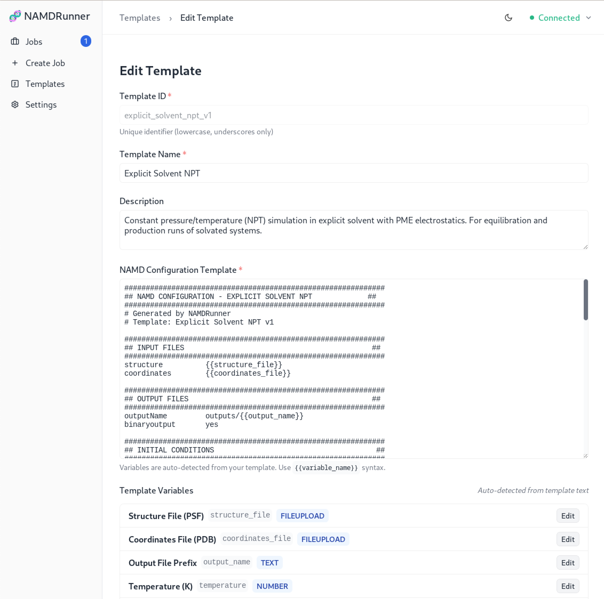</p>

<p align="center">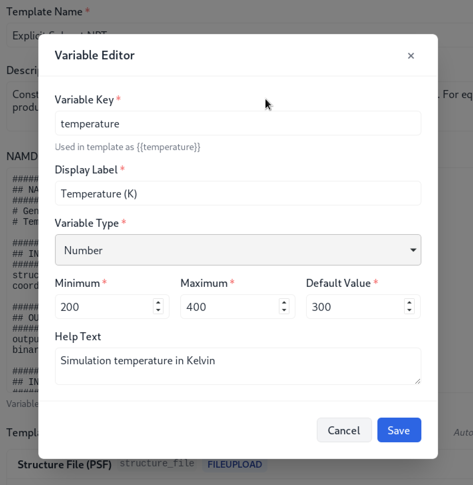</p>

### Job Configuration

Users select a template and configure resources (Time, CPU, GPU).

<p align="center">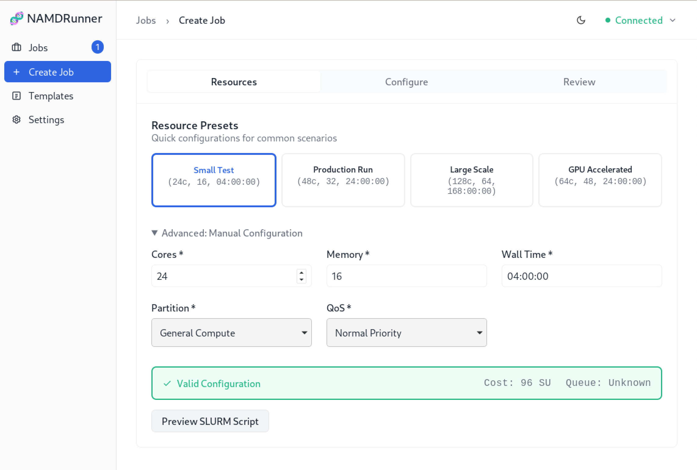</p>

<p align="center"></p>

<p align="center">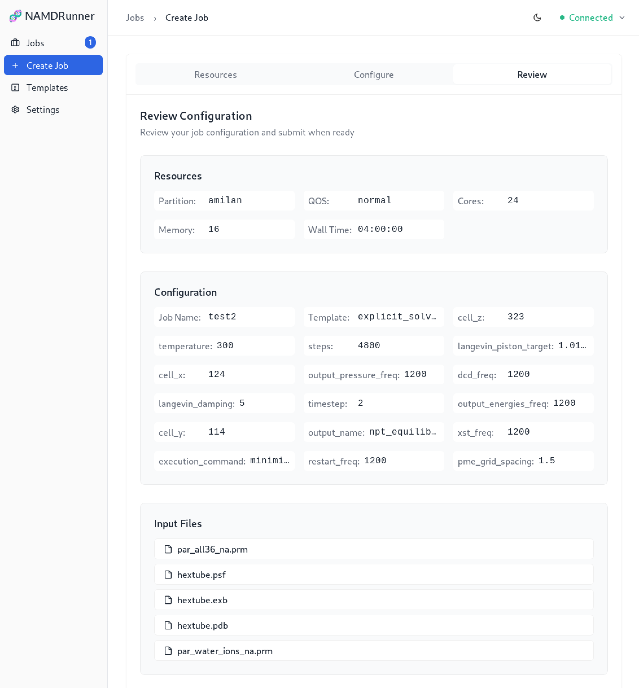</p>

<p align="center"></p>

<p align="center">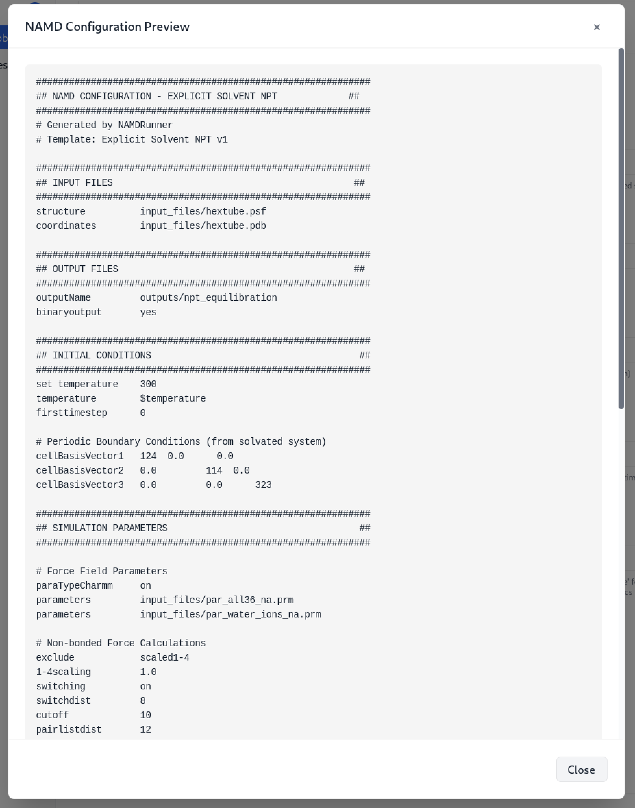</p>

<p align="center">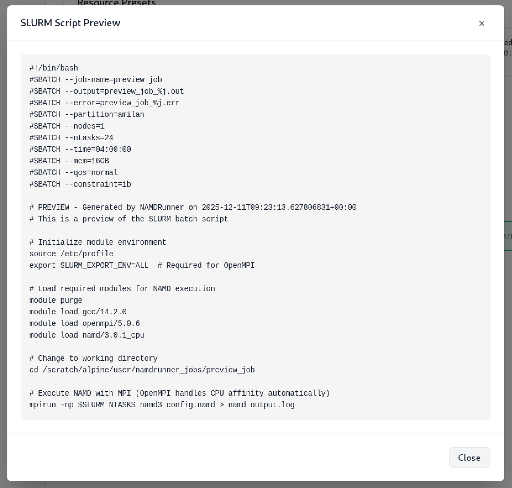</p>

### Results & Outputs

Browsing output files and downloading results after simulation completion.

<p align="center">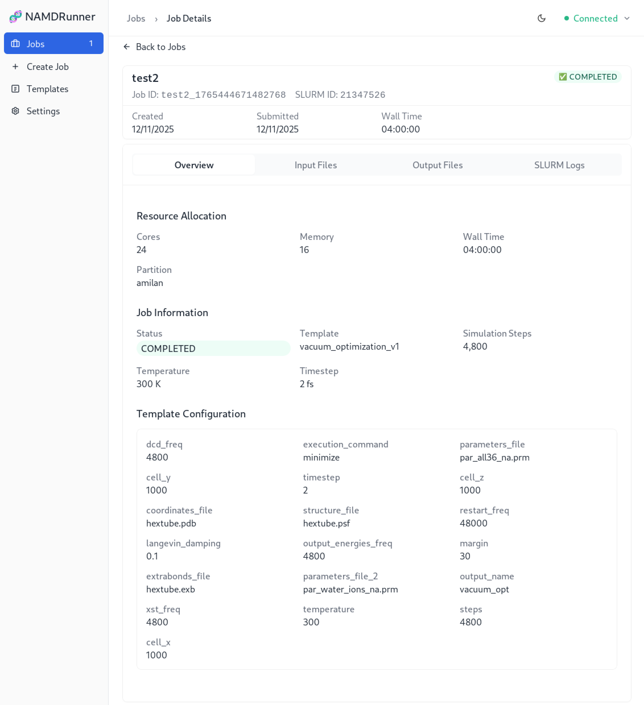</p>

<p align="center">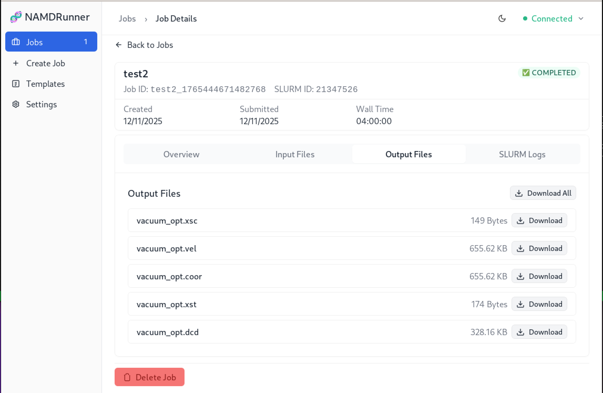</p>

### Application Settings

<p align="center">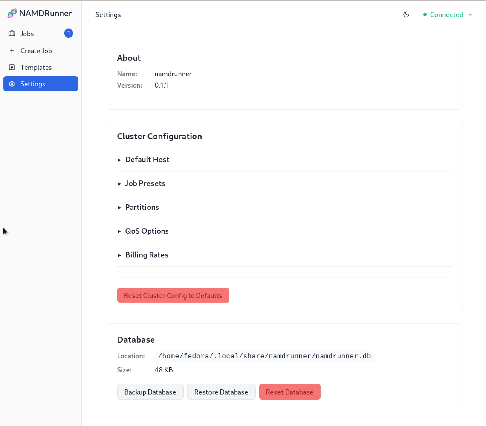</p>

## How to Run

### Installation

The project is set up with **GitHub Actions** to automatically build binaries for Windows and Linux on every release.

* **Windows**: Download the `.exe` installer.
* **Linux**: Download the `.AppImage`, which is bundled with all dependencies. Make it executable with `chmod +x` and run.
* **macOS**: Can be built manually (see below).

### Build Steps

```bash
# General Build (detects current OS)
npm run tauri build

# Linux (produces .AppImage and .deb)
npm run tauri build -- --target x86_64-unknown-linux-gnu

# Windows (produces .exe and .msi)
npm run tauri build -- --target x86_64-pc-windows-msvc
```

### Development Setup

```bash
# Clone the repo
git clone https://github.com/travisformayor/NAMDRunner.git
cd NAMDRunner

# Install dependencies
npm install

# Run locally
npm run tauri dev
```

For detailed contribution guidelines, see [docs/CONTRIBUTING.md](docs/CONTRIBUTING.md).

## Future Work

* **Job Chaining**: Enabling multi-stage workflows (e.g., Minimization -> Equilibration) where child jobs inherit parent files. Also enables support for restarting jobs that failed or ran out of time or resources.
* **Automation Builder**: A visual tool to drag-and-drop workflow steps and add additional custom steps (e.g., running a script between jobs).

---

### AI Usage Disclosure

Following an AI disclosure policy for this project, I used Claude Code to assist with development, following detailed task plans and architectural oversight.
